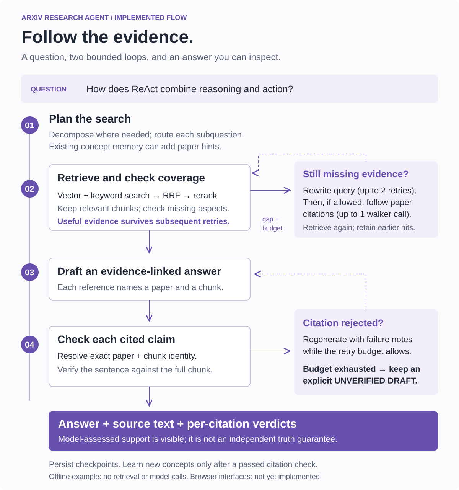
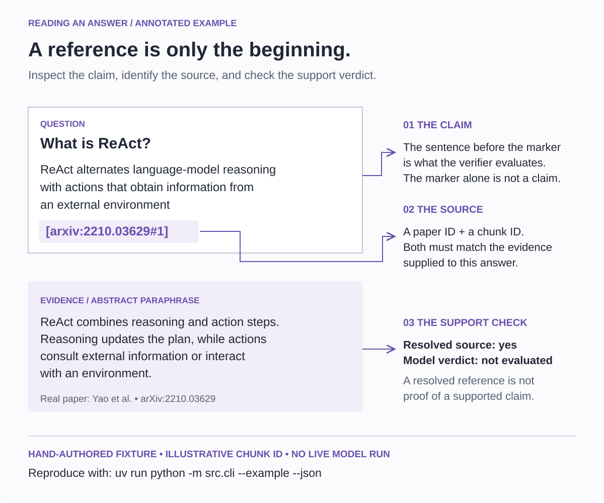

# arXiv Research Agent

**Explore the LLM-agent literature, and follow an answer back to its evidence.**

Ask a research question over a curated arXiv corpus. The agent searches paper chunks, checks whether they cover the question, can follow paper citations to expand the corpus, and drafts an answer with paper-and-chunk references. Each reference receives a separate support check.

**Status: research prototype.** A single-question CLI is available. The browser chat and graph interfaces are not implemented. Citation support is assessed by a model; an answer that fails the check is displayed as an **unverified draft**.



[Try the offline example](#see-the-output-without-api-keys) · [Run a real question](#run-a-real-question) · [Architecture](docs/architecture.md) · [Evidence example](docs/evidence-example.md) · [Validation and limits](#validation-and-current-limits)

## What this project is for

A question such as **“How does ReAct combine reasoning and action?”** needs more than a list of paper links. This project keeps the research process inspectable:

- **Find evidence:** combine vector and keyword search, fuse their rankings, rerank, and filter irrelevant chunks.
- **Fill gaps:** retain useful evidence across query rewrites and optional citation traversal.
- **Trace an answer:** connect a sentence to its `[paper_id#chunk_id]` reference and the retrieved text.
- **Expose uncertainty:** report rejected or unresolved references instead of silently passing them.

The current scope is a curated collection of LLM-agent papers. It does not establish exhaustive literature coverage or independently prove that every sentence in an answer is correct.

## See the output without API keys

Requirements: Python 3.11+ and `uv`.

```bash
uv sync --frozen
uv run python -m src.cli --example
# The same annotated output as machine-readable JSON:
uv run python -m src.cli --example --json
```

The example is **hand-authored**: it uses a real paper, paraphrased evidence, and an illustrative chunk ID. It exercises citation-to-evidence resolution without a database, network requests, or model calls. It is not a recorded research run or a benchmark result.



See the [complete example and its provenance](docs/evidence-example.md). Live output has the same structure, with the model's support verdict and rationale added to each reference.

## Run a real question

In addition to Python and `uv`, use Docker with Compose and configure the providers in [the model registry](src/llm/registry.py):

| Component | Current provider | Required environment variable |
| --- | --- | --- |
| Planning, generation, verification | DeepSeek | `DEEPSEEK_API_KEY` |
| Embeddings | OpenAI | `OPENAI_API_KEY` |
| Reranking | Cohere | `COHERE_API_KEY` |

OpenRouter is available as an adapter but is not in the active default registry. Semantic Scholar access may be rate limited; its API key is optional. Model names live in the registry and may need updating as provider availability changes.

**Ingestion and live questions make external API calls and may incur usage charges.** The offline example above is the zero-call starting point.

```bash
cp .env.example .env
# Fill the three provider keys in .env.
# Keep POSTGRES_PORT=5433 for the supplied Docker mapping.
# Set LANGSMITH_TRACING=false unless you intend to enable tracing.

uv sync --frozen
make db-up      # start Postgres and wait for its health check
make db-init    # create application tables and LangGraph checkpoint tables
make ingest     # download/index the seed corpus; uses the embedding provider

uv run python -m src.cli "How does ReAct combine reasoning and action?"
```

Useful variants:

```bash
uv run python -m src.cli "What is ReAct?" --json
uv run python -m src.cli "What is ReAct?" --skip-reflection
make test-unit
```

Every CLI question uses a fresh checkpoint thread. `--skip-reflection` skips assistant-message storage and semantic reflection; LangGraph checkpoints still persist in Postgres. The CLI is a single-question entry point, not a multi-turn chat interface.

Exit codes: `0` for a completed example or a passed citation check; `2` for a completed **unverified draft** or invalid command arguments; `1` for configuration/runtime failure. Missing evidence or a rejected reference must be inspected before relying on the answer.

The older `make ui` and `make ui-graph` commands now explain that those interfaces are unfinished instead of pointing to nonexistent Python files.

## How it works

The implementation uses a LangGraph state machine with bounded retrieval and verification loops. Working evidence is kept in graph state; checkpoints and session records are stored in Postgres; a concept graph can supply additional retrieval hints.

| Read this code | What it owns |
| --- | --- |
| [Graph builder](src/graph/builder.py) and [routing rules](src/graph/edges.py) | Node order, checkpointing, and retry exits |
| [Retrieval node](src/graph/nodes/retrieve.py) | Hybrid search, relevance/coverage checks, and evidence retention |
| [Citation walker](src/retrieval/multi_hop/citation_walker.py) | Bounded expansion through paper references/citations |
| [Citation contract](src/core/citations.py) and [verifier](src/retrieval/self_rag/verifier.py) | Claim text, full paper/chunk identity, evidence support checks |
| [Reflection node](src/graph/nodes/reflect.py) | Store answer metadata and gate new semantic learning |
| [CLI](src/cli.py) | Question input, explicit verification status, and inspectable output |
| [Evaluation runner](src/eval/runner.py) | Gold questions, retrieval/citation metrics, and model judging |

The [architecture note](docs/architecture.md) distinguishes implemented paths from unfinished integrations, including conversational memory. It also explains the small changes made during this presentation pass.

## Validation and current limits

| Evidence | What it shows | What it does not show |
| --- | --- | --- |
| Offline unit tests and CLI example | Citation parsing, exact evidence identity, preservation of evidence, rejected-answer handling, and output behavior | Live provider quality, database integration, or benchmark gains |
| [Phase 10: 30-question historical run](docs/eval_baselines/BASELINE_2026-05-04_phase10.md) | A recorded baseline from May 2026 | Current performance: it predates fail-closed verification and includes known failures |
| [Phase 10.5: five-question historical sample](docs/phase_reports/PHASE_10_5_REPORT.md) | Zero hard failures in the final sample, but citation precision/recall both **0.00** | A successful citation-quality result or a full 30-question rerun |

This update fixes reproducible citation/data-flow defects. **No new live-model or full-dataset score is claimed.** A fresh five-question evaluation should precede a new 30-question run, using a fresh output directory/checkpoint so historical rows are not mixed into new results.

Remaining limitations:

- The model may reject valid evidence, accept weak evidence, or return malformed responses. Fail-closed handling remains in place.
- Citation metrics measure overlap with expected paper IDs. They are distinct from sentence-level factual support and answer completeness.
- Claim extraction uses sentence boundaries. Complex citation styles, abbreviations, and multi-claim sentences need further work; uncited sentences are not exhaustively verified.
- Survey coverage and decomposition still need live evaluation. Some single-question forms bypass decomposition under the existing heuristic.
- Episodic storage and compression helpers exist, but compressed conversational history is not yet wired into answer generation. The browser interfaces are also unfinished.

## Provenance

This repository contains the research implementation, tests, and phase records. Diagram boxes and example output describe the code; they are not screenshots of an existing browser product. The example cites [Yao et al., *ReAct*](https://arxiv.org/abs/2210.03629) and labels its paraphrased fixture explicitly.

Project license: [MIT](LICENSE). Paper text and external service/data terms remain with their respective owners.
