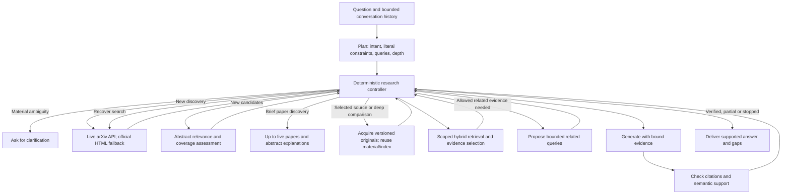

# arxiv-research-agent

ARA is a conversational arXiv research agent. It discovers relevant papers from live arXiv searches, explains the matches using abstracts, and retrieves original evidence for deeper questions. One LangGraph controller admits actions, observes progress, and stops on evidence, time or cost limits.

## Start

Python 3.11+, Docker, and `uv` are required. Configure the provider keys and local Postgres settings using `.env.example`. DeepSeek Flash supplies the main and fast roles; OpenAI embeddings and Cohere Trial are used only for original-text retrieval. The existing checkout can also load its configured macOS Keychain credentials.

```sh
make install
make db-up
uv run python -m scripts.bootstrap_db
make ui
```

Open http://127.0.0.1:8000. No seed-corpus ingestion is needed. The schema migration preserves existing paper records, chunks and checkpoints. Do not use `db-reset` to apply migrations: it deletes the Docker volume.

## Research flow



- Every **new discovery** makes an arXiv HTTP request. There is no local/auto/online mode or user toggle. If the API is unavailable, the adapter can query official arXiv HTML, with separately recorded provenance. A cached old search is never presented as a fresh search.
- Model responsibilities: interpret the request, propose short queries, assess topical relevance and uncertain constraints, select evidence and explain findings. Hard constraints and soft preferences must quote human messages. Earlier assistant recommendations do not become user requirements.
- Program responsibilities: validate identities/schema, select admissible actions, track new candidates, enforce bounds and deliver honest partial results. Empty title searches can broaden to title/abstract; empty conjunctions can relax; crowded pages can switch ordering or paginate. An unchanged pool does not trigger another assessment. Within a turn, unchanged sources already excluded as namesakes, incidental uses or known violations are not rejudged; changed source content invalidates that exclusion. Low-recall compound phrases can relax one modifier before relevance is assessed again.
- An explicitly chosen paper bypasses recommendation screening. A request for implementation, experimental details, or rigorous comparison can trigger original-text reading without the words “read PDF”. A simple discovery request uses abstracts. More than three selected originals triggers a batching clarification.
- Primary papers and directly related mechanism papers are eligible. Incidental usage and mathematical namesakes are excluded unless those are the user's subject. Unknown constraint compliance is recorded as uncertainty. Latest searches prioritize confirmed **first publication**, not update time. No padding to five papers or popularity claims.
- Reading retains RAG: query rewrite → embedding → scoped vector/full-text recall → fusion → reranking → source-sentence selection → sufficiency check. Originals prefer version-pinned arXiv HTML with mathematical alttext preserved; unavailable/invalid HTML falls back to PDF, with provenance recorded. Retrieval is restricted to acquired paper versions. Synthesis and verification use the same source excerpts. An unavailable judge is not a negative relevance verdict.
- Explicit result quantities are enforced after relevance/freshness selection, without narrowing the candidate pool. Focused reading keeps the user's resolved question as the acceptance scope; planner suggestions cannot add unrequested training/inference comparisons. Comprehensive overviews can use a bounded outline.
- One related-paper expansion is allowed for broad/comparative requests when evidence is insufficient, within the same total reading cap. A focused single-paper task stays within its source unless the user requests related work.

## Storage and caching

Postgres stores checkpoints and source material. It is not the boundary of the discoverable literature.

| Material | Identity and reuse |
|---|---|
| Search responses | Stored for diagnostics/replay; new discovery still performs HTTP |
| Exact-version metadata/original | arXiv ID plus `vN`; HTML/PDF format and material hash recorded; unversioned identity lookups refresh metadata |
| Indexed full text | Versioned paper ID plus parser/chunker and embedding model/configuration fingerprint |
| Embeddings | Provider, model, dimension and exact text hash; only missing texts call the API |
| Plan/assessment | Request/history, current date, source contents, prompts/schema and actual model/reasoning settings |

Changing the paper version creates a separate material record. Changing the processing fingerprint creates new chunk IDs; old IDs remain available to historical citations. Retrieval uses the active index for each selected version. Concurrent acquisitions share a PostgreSQL advisory lock. Failed/cancelled work cannot replace an already complete index with a failed one.

## Limits and costs

Defaults: 8 search actions, 60 candidates, 3 semantic assessments, at most 5 result cards, and at most 3 read papers. Search acquisition/assessment shares a 90-second window; a whole deep-reading turn has a 300-second deadline and retains its $0.15 request-admission cost limit. Source checks reserve three seconds for checkpoint/delivery and preserve completed siblings when another check times out. Late semantic retries are not admitted. Individual indexing is capped at 75 seconds and 160 chunks. Original-evidence retrieval has bounded local recovery and answer verification permits at most two rewrites. These are execution bounds, not completeness guarantees.

The UI uses the existing **cumulative US$2** ledger at `data/eval_outputs/round1-budget.json`, including all previous requests. Each search has an estimated US$0.05 admission ceiling, raised to US$0.15 when original reading is required; the cumulative ceiling always wins. Reservations happen before transmission, and concurrent calls/retries share the ledger. Unknown charges keep their reservations. Estimates are not provider invoices. Cohere is admitted under the configured Trial policy.

Opening/reloading the page, creating a conversation and offline tests do not call a model. Main (Pro) and fast reasoning can each be changed in **思考设置**; both use Flash. Each turn freezes its settings. More thinking can cost more and need not improve an answer.

## Inspect and test

**查看本轮过程** shows resolved intent, query actions, candidates, decisions, exact-version acquisitions, retrieval and citation checks. Local JSONL traces also preserve visible structured model output and parse errors; hidden reasoning and credentials are not recorded. Incremental UI polling updates affected regions without rebuilding the conversation.

```sh
# Unit tests block live HTTP, including accidental paid calls.
uv run pytest tests/unit -q
# Real database, synthetic acquisition/embedding adapters; no paid APIs.
INTEGRATION_TESTS=1 uv run pytest tests/integration/test_db_bootstrap.py tests/integration/test_ingestion_concurrency.py tests/integration/test_ingest_partial_failure.py tests/integration/test_paper_search_resume.py tests/integration/test_resume.py -q
uv run ruff check src tests scripts
```

The old fixed-corpus gold questions and metrics under `src/eval` are historical diagnostic assets, not a validated evaluation of this architecture. Their automatic CLI entry was removed. The new research-quality evaluation set will be designed separately; passing behavioral tests or a few live examples is not a claim of general research accuracy.

For a Chinese walkthrough, see [RUNTIME_WALKTHROUGH.md](docs/RUNTIME_WALKTHROUGH.md). Historical design/phase reports document earlier versions and do not override this runtime description. Legacy database tables and historical result files are retained; unused concept graph, reflection, citation-walk, HyDE, publisher-specific acquisition and local-corpus runtime branches have been removed.

The source-backed 12-scenario task suite and budgeted local-API runner are described in [RESEARCH_EVALUATION.md](docs/RESEARCH_EVALUATION.md). Mechanical checks and semantic source review are separate; passing checks is not a research-accuracy score.
