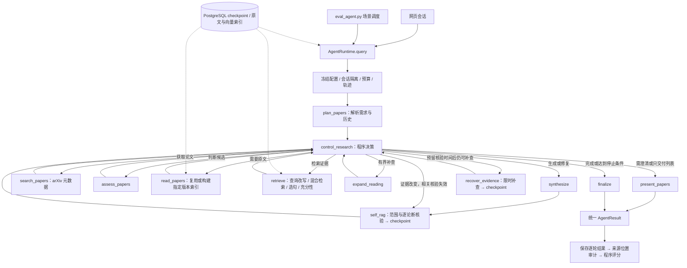

# Agent 运行与评测入口

实现日期：2026-09-17。UI 和独立评测均调用 `src.agent.AgentRuntime.query`。现有网页进程需要重新加载代码后才能使用改动；本次没有为了实验重启或占用它。

## 公共接口

`AgentRequest` 包含问题、session/turn/run ID、阶段配置、Main/Fast 档位、预算策略、日期基准和缓存/上下文模式。`AgentResult` 包含用户可见输出、路由、结构化会话状态、每轮费用、角色用量、实际配置、耗时及轨迹路径。研究状态机仍是同一个 LangGraph，没有另建一个测试专用 Agent。

```python
from pathlib import Path
from src.agent import AgentRequest, AgentRuntime
from src.llm.budget import RequestBudget
from src.llm.stages import StageSettings

# query 会执行真实服务调用；预算必须由调用者明确给出。
budget = RequestBudget(1, path=Path("data/eval_outputs/manual/budget.json"), cohere_trial=True)
agent = AgentRuntime(Path("data/eval_outputs/manual"), budget)
request = AgentRequest(
    question="读 2312.04511v3，解释有依赖关系的工具怎样并行执行。",
    stages=StageSettings(profile="critical_high"),
)
result = await agent.query(request)
print(result.output["answer"], result.cost)
```

多轮保持同一个 `session_id`，每轮使用新 `turn_id`。不同场景使用不同 session；同 session 不允许重叠执行。UI 保留原有重复 POST 请求对账；模块发现同一 turn 已有轨迹会拒绝再次收费执行。评测在请求发出前保存 attempt，重启后不会悄悄重复不确定的请求。

费用按照不可变 `turn_id` 过滤账本，并记录实验 `run_id` 和模型阶段。角色用量使用 ContextVar 隔离，子任务只继承所属运行的统计对象。未知费用保留准入预留，绝不当作零。

## 实际路由



这不是每次都会走遍的线性流水线：指定身份可跳过候选筛选，澄清无需取得论文，控制器限制补查/修复次数并检查预算、时间和无进展状态。`retrieve` 内部可能触发一次有界原文专项核查。图中的最终评分位于评测程序，ARA 内部 verifier 不充当外部评分器。

## 模型档位

所有聊天阶段请求同一个 `deepseek-flash`。`src/llm/stages.py` 是唯一阶段配置入口：

- `legacy`：保留历史调用点的角色和关闭思考设置，只用于基线。
- `semantic_low`：所有语义阶段开启 Low；纯格式任务允许非思考。
- `critical_high`：意图、候选判断、充分性、事实核验、专项核查、语义修复 High，其余语义阶段 Low。
- `semantic_high`：除查询改写外，语义阶段 High；查询改写 Low。
- `ui`：网页 Main 控制上述关键阶段，Fast 控制其余语义阶段；不会因旧调用点的 `thinking=False` 关闭语义判断。

Main/Fast 是角色，不是 DeepSeek 的两个型号。每次请求记录阶段、角色、实际努力程度、输出预算、请求模型和返回模型。Low/High 的默认推理余量分别为 2048/8192。非 legacy 语义调用的总输出下限为 4096；遇到 `length` 可按相同提示词和档位补一次更大容量请求，上限 16384，重新进行预算准入。解析失败与提供方异常仍分别记录。显式 `--total-output-cap 8192` 会使 Low/High 都取得同样的 8192 总容量，并禁止自动扩容，从而避免混淆档位与容量效应。总容量包含推理与可见输出，不能保证一定剩下多少可见 token。未做重复对照前不宣称某一配置最优。

## 上下文与缓存

会话状态存于 LangGraph checkpoint：当前目标、带来源轮次的用户约束/偏好、论文展示顺序及版本、选中的论文和待澄清项。Planner 接收稳定序列化的状态和最近最多四条原始消息；原始消息预算 7000 字符。旧模式最多六条、12000 字符，可通过评测参数对照。用户约束仍需是实际人类消息中的原话；旧助手回答不变成论文证据。

普通 arXiv 搜索允许命中现有资料缓存；近期排序查询缓存最长一小时，普通资料默认一天；明确要求强制刷新时绕过。论文原文仍按版本及解析/embedding 索引标识复用。模型结果缓存绑定输入、提示、Schema、日期和阶段配置；评测默认绕过模型结果缓存。提供方 prompt cache 自动运行，轨迹记录实际命中 token；它不复用最终答案，也不免除新生成的推理输出费用。

查询向量的持久缓存、请求合并，以及更细的上下文压缩消融尚未完成。公开 `response_fields` 现在可让生成节点直接产出类型化值，由程序渲染并沿用原文核验；实现及其测量边界见 [结构化结果协议](eval_design/STRUCTURED_RESULTS.md)。

## 引用修复与逐句核验缓存

2026-09-20 起，已保存初次核验结果后，`recover_evidence` 先对失败的自然语言论断尝试一次现有证据的引用重绑定。模型只能返回同篇、同版本、已取得片段的编号；程序保持正文不变，修改引用标记，然后返回 `self_rag` 正常核验。提议本身不构成支持结论。没有可用绑定或提议仍未通过时，保留原有一次原文补查与有界改写路径。标志存入 checkpoint，并在新一轮重置。结构化回答仍沿用同时更新值、说明和引用的原有修复路径。

范围与覆盖判断每次针对完整草稿重新执行，解析出论断依赖关系。事实核验随后仅接收当前论断、表头、明确的前文依赖以及所引用的证据；未声明的指代不能靠来源内容猜测。缓存绑定这些输入、问题、来源/专项审阅信息和模型阶段配置。无关句子改变时可复用独立判断，前提句、引用或来源改变会使相关判断及其传递依赖失效。没有范围判断的底层调用保留全文上下文和保守的全文缓存键。未通过格式或依赖核验的结果不进入可复用判定。

这减少的是重复来源核验；范围判断、必要的引用重验和新证据获取仍有成本。缓存命中不等于独立事实正确性保证，速度和费用以保存的真实轨迹为准。

## 独立 Python 入口

在仓库根目录运行，默认只显示计划，不调用模型：

```bash
.venv/bin/python scripts/eval_agent.py \
  --case c09-dependency-example --case c10-rewoo-observation-boundary \
  --profile legacy critical_high
```

运行须加 `--execute --budget ... --output ...`；账本与配置不相符时拒绝续跑，不会重置。跨代码版本使用新输出目录，增加 `--ledger <已有 budget.json>` 即可沿用累计预算；此时 `--budget` 是原账本的总上限，不是新追加额度。账本将继续追加请求，旧结果各自保存的费用不随之改变。`--concurrency` 控制场景并发，同一场景内逐轮执行。`--repeat` 用于重复观察。`--phase-case` 和 `--phase-profile` 可在同一份完整实验计划/账本内先执行小批，再移除这些参数继续剩余项。`--rescore --output ...` 只读取已有结果重评分，不调用模型或数据库；若缺少原始来源审计，会保持未评分状态。评分器变更后如需重评历史结果，应另存报告，不覆盖原实验报告。

输出目录包含 `manifest.json`、逐轮 `records/*.json`、`traces/`、`summary.json`、`summary.csv`、`scores.json` 和 `report.md`。账本默认是目录中的 `budget.json`，显式 `--ledger` 时沿用外部累计账本。Manifest 固定代码/数据哈希、日期、配置、缓存方式和并发；代码变化需要新实验目录，旧失败记录保留。`scores.json` 保存当前评分器代码指纹及逐题事实匹配明细，重评分不改写原始执行记录。

固定材料先通过 `--prepare-materials --materials <新路径>` 准备；这一步只获取元数据、读取已有索引，不调用模型，也不自动补建缺失原文。`--materials` 的执行组会验证索引内容哈希并复用已有原文。固定池会提供声明的候选，故衡量的是给定材料后的判断与分析，不能用其成绩宣称联网检索召回率。真实发现能力使用不带 `--materials` 的联网组另测。

## 成绩解释

当前分开使用 `natural_cases_v5.json`（默认，12 场景/15 轮）与 `structured_cases_v5.json`（6 个单轮任务，21 组事实及一个推荐排序）。自然组保留 v4 原问法，自动检查路由、状态、身份/版本、适用约束、发现列表顺序和原文位置，自由解释/事实/阅读推荐排序另做来源复核。结构化组公开字段名、类型、子问题和指定版本；正确值、别名和评分规则只在评测器。两组输入不同，不能混算提升率。

`AgentRequest(response_fields=...)` 是普通模块接口，使用同一规划/检索/核验链路。生成节点一次输出值与解释，程序把同一数据渲染成可见表格；原文 verifier 核验整行，未通过的行和字段共同移除。缺字段会降低完整性，完全失败仍计入结构化事实分母；旧草稿恢复携带对应字段，新轮清空。无需额外字段抽取调用。公共回答协议为 `ara-answer-3`，外层 AgentResult 仍为版本 2。

纯评分器再次检查渲染一致性、来源版本与交付绑定，然后按类型、冻结别名、数值、集合、序列及关系评分。`fact_accuracy` 是明确字段契约的严格匹配率，不是整段解释的语义正确率。文本新同义表达仍可能需要复核；ARA 自身 verifier 也不是独立评分模型。报告均带适用分母与分组名。无独立 LLM judge 调用。

旧 ara-answer-2 的 verifier 抽取试验保留为显式开关，用于历史复现；v5 两组禁止该开关。旧 Agentless 表示成功 7/7、助手来源复核 4/4、字段匹配 0/4 的失败保留。v5 已完成三条真实结构化校准：GQA 3/3、Agentless 3/4、LLMCompiler 0/4，总计严格匹配 6/11；字段全部成功绑定，部分值因同义措辞和例子符号不同而失分，值域仍需进一步定义。自然比较在修复名称入口后仍为 partial，不能据此选定 High/Low。[协议与入口](eval_design/STRUCTURED_RESULTS.md)，[本轮实测](../data/eval_outputs/typed-calibration-20260917/analysis.md)，[旧试验记录](../data/eval_outputs/stage-structured-20260917/analysis.md)。

## 首轮回归后的执行边界

- 明确点名阅读/比较的论文先用元数据解析身份，跳过推荐筛选；不匹配目标的论文仍需阅读并解释。歧义不猜 ID，有限补查后不足则保留 partial。多篇比较为每篇建立独立检索范围，共用总证据预算。检索问题保留技术比较维度，另用 `SubQuestion.sufficiency_question` 限定该论文证据包需要建立的自身机制与作用对象，避免把适配维度扩展成论文必须证明的能力。逐篇充分不等于整题完成；完整用户问题、适配、排序及其他具体要求仍进入最终综合与覆盖核验。单篇阶段指令不进入最终生成。查询改写只接受单条查询，格式不合格时回退原问题，不额外付费修格式。
- 原文子任务最多两路并发，按真实依赖调度；任一路完成立即补入已就绪任务，不等待整个批次。依赖未满足的任务不能提前执行，异常或取消会回收其他运行中的任务。整次 retrieve 节点仍在完成后提交 checkpoint，不宣称中途每篇证据已分别持久化。
- 范围核验在完整用户问题下解释简写的要求，并返回每项的 `required_structure`（`any` 或 `table`）。语义模型判断格式约束与内容覆盖；程序从真实 Markdown 表格位置标注语句结构，并拒绝以表外正文充当要求入表的内容。这是 Agent 内部核验，不是独立评测器的事实评分，也不能保证模型对所有格式要求的解释都正确。
- 精确 ID 与附带名称分开验证。ID 使用完整标识边界，不能把 `v1` 当作 `v12`。名称和输入原文两侧均可剥离独立核验过的 ID，规范化由此留下的标点，因此 `名称（ID，说明）` 与 `名称（说明）` 不会被误认为不同输入；描述文字仍须连续来自输入，不能拼接其他论文的描述或添加记忆中的名称。未知 ID、错误版本及虚构描述仍拒绝。
- Planner 提取人类原话中的输出要求。Scope 返回固定要求 ID 与回答语句 ID 的覆盖关系，程序拒绝新增要求、未知 ID 或无来源的重复标记。事实真伪仍由原文核验承担；范围模型不能凭记忆要求某篇论文一定有三个阶段。
- 引文省略号不作为句界；表格整行作为联合引用论断。表头随该行进入来源核验，通用列名无需单独加引用，表头中的事实、版本、单位和条件仍须与数据行一同成立。仅在对应数据行核验通过时恢复表头与分隔线，不依赖有限的表头词表。
- 专项核查选句超限时有界重新选择，无法完整装入的必要证据仍标记 incomplete，不取消完整性检查。
- 仅被未结算请求暂时占满的预算允许最多等 45 秒，且受本轮期限约束。无法解除的已结算/未知费用仍阻止新请求；等候没有准入预留，不会被算成实际 API 调用。等待超时用 `budget_wait_timeout` 区别于 `budget_exhausted`。
- 运行入口遭遇超时/取消/异常时，在最多 5 秒内读取相同 turn_id 的 checkpoint，通过已有 finalize 投影保留已核验片段；不重启图、不调用模型、不把上轮证据交付成本轮结果。停止原因仍保留，不能因此伪报 complete。
- 首次完整核验与可选补查是两个分别提交 checkpoint 的图节点。补查超时不提交未完成的证据变化，保留已有报告。若补查改变了某篇论文的任何片段，该论文的全部旧论断与所有工程推断都需重新核验；仅保留其他未改变论文中已核验的独立事实。跨论文论断必须整组满足保留条件，不能截取一个通过的引用。保留事实可供部分交付及后续核验复用，不代表整题完成。尚在核验节点内部、未完成的并行判断不能冒充已保存结果。
- `AgentRuntime` 提供单调时钟期限，节点记录本轮真实耗时。再次核验的预留为 `max(30 秒, 上次核验耗时×1.2+2 秒)`；生成修复还需加上 `max(5 秒, 上次生成耗时×1.2)`。可选补查最多 30 秒，并须扣除核验预留及 2 秒余量；可用不足 5 秒就不启动。补查结束后再次检查准入条件，时间不足则以 `verification_time_guard` 交付已核验片段。参数是保守估算，不能保证提供方下一次延迟；硬超时仍兜底，不把 partial 升为 complete。该行为有专门的取消、剩余时间与证据失效回归测试。

首轮配置筛选后的内容复核需另存来源和判断记录。模型对照在同代码、同数据、同材料快照下进行；早期单次结果只用于发现问题和筛选，不作为稳定准确率。

首轮已完成 16 次运行及逐题助手来源复核，合计已记费用与未知预留 $0.682581366 / $1。结果揭示输出容量、范围核验、句界/表格处理和并发准入问题，尚未选定默认档位。详见 [实测报告](../data/eval_outputs/stage-pilot-20260917/run/analysis.md)。本批没有做多轮上下文质量对照；UI 既有进程也没有重新启动。

2026-09-17 后续用户批准累计上限提高至 $1.30。最新冻结版两条明确原文任务的程序检查与助手来源/格式复核均通过，累计占用 $1.164183752，未知预留已包含其中。完整失败、题目修订、代码快照与复现命令见 [定向验收报告](../data/eval_outputs/stage-acceptance-20260917/analysis.md)。这不是全面稳定性验收，也没有选择最终 High/Low 档位。

其后结构化协议试验累计至 $1.281336808；用户再批准上限 $1.60。本轮三条 v5 结构化题与两次自然比较尝试新增 $0.098543746，累计 $1.379880554，剩余 $0.220119446。旧 605 条请求及 $0.1230588 未确认预留完整保留。最新 534 项单元通过，恢复/协议变更已有 3 项数据库集成通过。结果重评分不改变原始记录、summary 或账本。比较任务的逐论断核验与结构化值域尚未校准完成，见 [当前报告](../data/eval_outputs/typed-calibration-20260917/analysis.md)。
