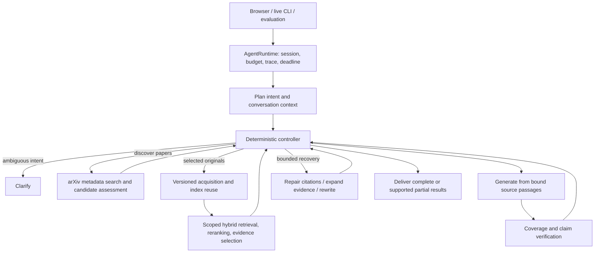

# Implemented research flow

The browser, live CLI, and Python evaluation entry use `src.agent.AgentRuntime.query` and one LangGraph. `make start` opens the browser workflow; `make demo` is an explicitly hand-authored offline example.

## Decision and evidence boundaries

- LLMs interpret needs, propose queries, assess relevance and select source sentences. The controller validates actions, enforces limits and tracks progress.
- Conversation state records user requirements, selected versions and displayed order. Previous assistant text supplies conversational context, never independent paper evidence.
- New discovery queries arXiv. Reading uses on-demand versioned originals, pgvector/PostgreSQL hybrid retrieval and Cohere reranking. Stored indexes are reusable material, not the boundary of searchable literature.
- Generation and verification share selected source passages and offsets. Paper identity, version, citation spans and declared context dependencies are checked. Citation repair proposals require ordinary verification before delivery.
- Scope checks are recomputed; source checks may be reused only with unchanged inputs and dependencies. Recovery is bounded by action counts, deadlines and the shared API ledger.
- PostgreSQL checkpoints retain completed node state. Interrupted optional work cannot promote unverified content into a complete answer.

The older citation-walker, concept-memory and reflection paths have been removed. The SVG assets created for that historical design remain archival; the current graph is above and in [AGENT_RUNTIME.md](AGENT_RUNTIME.md).

## Interfaces and validation

See [README](../README.md) for startup and CLI arguments, [the Chinese demo guide](INTERVIEW_DEMO.md) for a two-turn walkthrough, and [RESEARCH_EVALUATION.md](RESEARCH_EVALUATION.md) for measured results and their limits. An internal verifier's approval is not an independent accuracy score.

`src.core.citations` is a compatibility entry point for the offline fixture and shares the current sentence/table parser. The live CLI uses AgentRuntime's delivered output, preserving complete, needs_input, partial and incomplete states. It does not bypass cost admission or expose rejected draft claims as verified answers.
